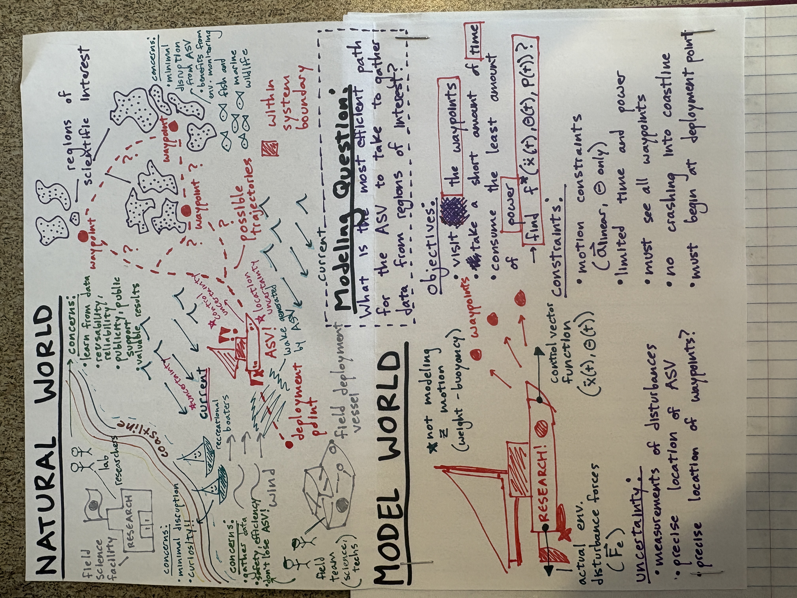

# Probabilistic Design Optimization Final Project: Trajectory Optimization Under Uncertainty for Autonomous Surface VEssel
> Ivy Mahncke

## Executive Summary

In this project, I use optimization to find the most efficient sequence of motion control commands for an Autonomous Surface Vessel (ASV) to execute as it explores designated waypoints over regions of scientific interest in a disturbance-heavy marine environment. I formulate the problem as a multi-objective optimization problem where distance from waypoints, elapsed time, and energy consumption are all costs to minimize. I also constrain the problem by designating off-limit areas such as coastlines or recreational marine areas, as well as maximum values for expended time and energy. I also model uncertainty that is present in the ASV's ability to sense its precise location, sense environmental disturbances, and execute desired motor commands.

## Background

### Problem Context

### Tenchi Diagram

## Formulation

### Objective Function

$$min f(u)=E[J_{time}+J_{energy}+J_{position}]$$

where: \
$J_{time}=T_{elapsed}=dt*k$ \
$J_{energy}=\sum_{k=0}^{k}\frac{1}{2}mv_k^2$ \
$J_{position}=||p_k-W_{s(k)}||^2$

w.r.t. \
$u=[u_{0}:u_k]=[v_{0}:v_k,\omega_{0}:\omega_k]$

s.t. \
$p \notin P_{off-limits}$ \
$J_{time}\leq T_{max}$ \
$J_{energy}\leq E_{max}$ \
$|v_k|\leq v_{max}$ \
$|\omega_k|\leq \omega_{max}$

### ASV Kinematics

All variables referenced here represent actual values, rather than values measured or intended by the aSV.

ASV state: $x_k=[p_x, p_y, \theta, v, \omega]$ \
ASV control: $u_k=[v_k, \omega_k]$ \
Environmental disturbance: $d=[d_x,d_y]$

Motion kinematics: \
$p_{x,k+1}^{}=p_{x,k}+(v_kcos(\omega_k)+d_x)*dt$ \
$p_{y,k+1}=p_{y,k}+(v_ksin(\omega_k)+d_y)*dt$ \
$\theta_{k+1}=\theta_k+\omega_k*dt$ \
$v_{k+1}=v_{cmd}$ \
$\omega_{k+1}=\omega_{cmd}$

### Uncertainty

*TODO: Gaussians for now; dig into more accurate modeling later*

#### Destination Uncertainty
Deployment point location uncertainty: $D_{actual}=D_{set}+\mathcal{N}(0,\sigma_{pos}^2)$ \
Waypoint location uncertainty: $W_{s(k), actual}=$W_{s(k), set}+\mathcal{N}(0,\sigma_{pos}^2)$

#### Measurement Uncertainty
Motion control uncertainty: $u_k^{actual}=u_k^{command}+\mathcal{N}(0,\sigma_{cmd}^2)$ \
Localization uncertainty: $p_k^{measured}=p_k^{actual}+\mathcal{N}(0,\sigma_{GPS}^2)$ \
Disturbance uncertainty: $d_{measured}=d_{actual}+\mathcal{N}(0,\sigma_{ADCP}^2)$

### Constants

#### Physical Constants
Physical constants derived from the [BlueRobotics BlueBoat datasheet](https://bluerobotics.com/wp-content/uploads/2023/03/BLUEBOAT-DATASHEET-v1.1-JAN-2025.pdf) and the [BlueRobotics battery](https://bluerobotics.com/store/comm-control-power/powersupplies-batteries/battery-li-4s-18ah-r3/) assuming 2 batteries and no payload, with a maximum usage limit equal to half of the ASV's total capacity.

$M=16.82$ kg\
$T_{max}=9$ h\
$E_{max}=266$ Wh\
$v_{max}=3\frac{m}{s}$ \
$\omega_{max}=2\pi\frac{rad}{s}$

#### Uncertainty Constants

*TODO: Research motors and sensors datasheets for these values* \
$\sigma_{cmd}=???$ \
$\sigma_{GPS}=???$ \
$\sigma_{ADCP}=???$

#### Modeling Constants
Modeling constants are chosen for their utility in balancing a smooth and realistic model. \
$dt=0.1$ s 

## Methodology

### Optimization Method

### Simulation Environment

## Results

## Conclusion

## Sources
### Accurate Modeling
[BlueRobotics BlueBoat datasheet](https://bluerobotics.com/wp-content/uploads/2023/03/BLUEBOAT-DATASHEET-v1.1-JAN-2025.pdf) \
[BlueRobotics battery](https://bluerobotics.com/store/comm-control-power/powersupplies-batteries/battery-li-4s-18ah-r3/) \
